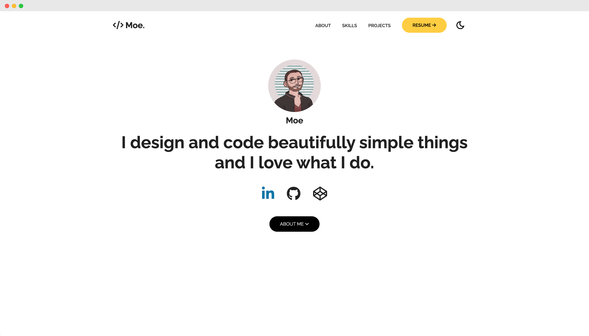

# 🚀 Personal Portfolio

A modern, responsive personal portfolio website showcasing my projects and skills. Built with pure HTML, CSS, and JavaScript.



## ✨ Live Demo

Check out the live demo: [Portfolio Website](https://majnioui.github.io/Personal-portfolio/)

## 🛠️ Built With

- HTML5
- CSS3
- Vanilla JavaScript
- Font Awesome Icons
- Google Fonts
- AOS Animations

## 📌 Key Features

- **Responsive Design** - Works perfectly on all devices
- **Dark/Light Mode** - Toggle between color schemes
- **Smooth Animations** - Enhanced user experience with AOS
- **Project Showcase** - Highlight your best work
- **Skills Section** - Display your technical expertise
- **Contact Form** - Easy way for potential clients to reach you
- **Social Media Integration** - Connect across platforms

## 🚀 Getting Started

### Prerequisites

- A modern web browser
- Basic understanding of web development
- Code editor (VS Code recommended)

### Installation

1. Clone the repository
   ```bash
   git clone https://github.com/majnioui/Personal-portfolio.git
   ```

2. Navigate to the project directory
   ```bash
   cd Personal-portfolio
   ```

3. Open `index.html` in your browser or use a local server
   ```bash
   # Using Python
   python -m http.server 8000

   # Using Node.js
   npx serve
   ```

## 📁 Project Structure

```
Personal-portfolio/
├── assets/           # Images and icons
├── files/
│   ├── script.js    # JavaScript functionality
│   └── style.css    # Styling
├── index.html       # Main HTML file
├── 404.html         # Custom 404 page
└── README.md
```

## ✏️ Customization Guide

### Content Updates

1. **Personal Information**
   - Edit `index.html` to update:
     - Name and title
     - About section
     - Contact information
     - Social media links

2. **Projects**
   - Add your projects in the projects section
   - Update project images in `assets/`
   - Modify project descriptions and links

3. **Skills**
   - Update the skills section with your expertise
   - Add/remove skill icons as needed

### Styling

1. Open `files/style.css`
2. Modify the CSS variables in `:root`:
   ```css
   :root {
       --primary-color: #your-color;
       --secondary-color: #your-color;
   }
   ```

### Images

Replace the following in `assets/`:
- `favicon.ico`
- Profile image
- Project screenshots
- Skill icons

## 🌟 Show your support

Give a ⭐️ if you like this project!
